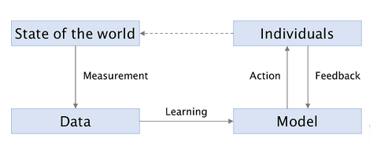
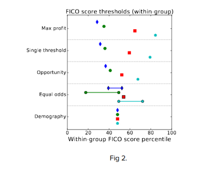
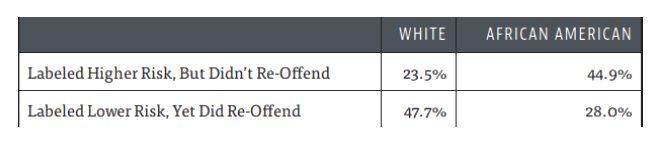
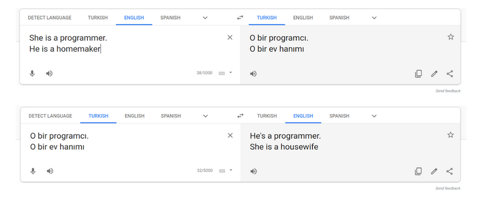

> 12/01/2020

## Machine Learning guinea pigs 

Across the world societies today operate with great financial [inequality](https://www.forbes.com/sites/niallmccarthy/2017/11/15/the-global-pyramid-of-wealth-infographic/#6dc995a5558b), this and other social disparities shape an individual's surroundings and opportunities. With recent [advances](https://www.kdnuggets.com/2019/12/predictions-ai-machine-learning-data-science-technology.html) in Machine Learning areas and applications (such as _reinforcement learning_ and _natural language processing_ amongst others), the field of Artificial Intelligence/ML is becoming an ever increasingly present in society, with applications across the whole spectrum of human practice (academia, industry, the arts). Subsequently an evolving tech-steeped geopolitical landscape, that will likely contribute to new [ideological forms and methods of conflict](https://www.ianhogarth.com/blog/2018/6/13/ai-nationalism), makes the design and consideration of ML systems all the more important. While actuarial (statistically grounded) methods can produce more accurate judgements than clinical (personal) discernment,[^1] the prevailing methods of the day carry risks of reinforcing and exacerbating social stereotypes and demographic disparity. In this essay I’d like to illustrate the potential for ML systems to cause harm, the various forms this can take, and how, as designers, programmers and instigators of these systems, one has responsibility for challenging and mitigating this outcome to create fairer technology.

Machine learning is the study of algorithms and statistical models that perform a specific task without explicit instructions. The models and algorithms are created through a process of “learning”, relying on patterns and inference to create a model from data. However as suggested in the _[Fairness in Machine Learning book](https://fairmlbook.org/index.html)_: Machine Learning is a socio-technical system not a purely mathematical one[^2]. The use of data collected from and by people exhibits it’s unification of statistical reasoning, computational techniques and human behaviour. It is becoming an increasingly prevalent tool across a range of digital technologies used today, from widely used social media sites and search engines, as well as in criminal justice and the commercial sphere.

The process of _learning _works by generalising about the target data; for example, it might be fed thousands of images and then find common patterns in the images. Machine learning applications can be distinguished by [three](https://www.kdnuggets.com/2019/11/beginners-guide-three-types-machine-learning.html) main actions, regression (finding a line or curve that describes a relationship between two or more variables), classification (classifying an observation as one of a set of categories) and clustering / information retrieval (e.g. finding documents that match a query). The former two being forms of _supervised_ (where the data is fully labelled) _learning_ and the latter being _unsupervised_ (the data is not labelled).[^3] ML is a tool that learns by example. This alerts us to one of the immediate dangers of such a system. If the original samples contain a bias or systematic prejudice then it will absorb that bias into its logic through it’s inductive process of generalisation. As “historical examples will almost always reflect historical prejudices against certain social groups, prevailing cultural stereotypes, and existing demographic inequalities”, it is likely that these biases will be _learnt_. [^4] Analysing and understanding the inner logic of these models is difficult or impossible as ML produces “[black boxes](https://towardsdatascience.com/the-black-box-metaphor-in-machine-learning-4e57a3a1d2b0)”; the exact decision circuits are complicated and abstract and thereby difficult to follow. Consequently it is important to scrutinise the systemic weak points where bias can enter a model.

Fig. 1. The Machine Learning loop [^5]

The diagram above shows the “Machine Learning Loop”, each of the connecting arrows are processes within the loop where bias can be introduced. In measurement, humans make subjective decisions about what data to collect or use and this can lead to bad data informing the model. _Measurement bias _for example “occurs when the data collected for training differs from the data collected during production”. S_ample bias _and _prejudicial bias_ are also two other types that can occur during the _measurement_ stage, this is where the bias may not represent the full problem space or is not relevant to the problem[^6]. Even without specifically mentioning an attribute, one such as race can creep into model due to its relationship to other factors, perhaps the area someone lives. An interesting example of this is the [street bump app](http://www.streetbump.org/), a crowd sourcing tool which “helps residents improve their neighbourhood streets”, by collecting data on the condition of roads via their smartphones, it provides governments with that data to organise a responses. Although the data points themselves are relating bumps and anomalies on certain bit of road, the very fact that it is partly geographic cements a societal connection. Smartphones are less prevalent in low income areas and places with a greater elderly population so the data will contain this inherent socio-geographic skew. This is a relatively harmless example but it alludes to the essentially people-driven data collection system we have, where societal structures and subjective human decisions have an effect.[^7] Another stage where bias can occur is the learning stage itself, this can broadly be called _algorithmic bias_.[^8] In some cases disparate treatment of the eventual stakeholders in an algorithmic system can occur. As seen below (Fig. 2), it can be a side effect of maximising accuracy and the majority culture tends to win out. 

So how can we define, measure and regulate these systems? There is ongoing [movement](https://www.youtube.com/watch?v=jIXIuYdnyyk ) in academia to define various metrics of fairness[^9] and how and where these can be applied to ML systems. The paper _Equality of Opportunity in Supervised Learning _[^10]_ _suggests a methodology of adjustment (or fairness constraint) to remove harmful discrimination by a predictive system (there is also a companion [presentation](https://research.google.com/bigpicture/attacking-discrimination-in-ml/) with interactive visualisations demonstrating the methods in a toy scenario). By adjusting the sliders one can see how using various combinations of thresholds, affects the outcome for various stakeholders in the scenario: the two demographic groups involved as well as the business interest (the profit gained). This allows you to observe the various adjustments one can make to a model, and how these will affect different groups. Again in the graph below (from the paper), you can also see how various approaches yield different outcomes for different demographic groups. Single threshold, also described as _group blindness_, is an approach where one threshold is applied across all groups,_ seems fair, right_? However variables (such as **amount of debt** or **mix of accounts**) used to calculate the score may be spread differently in the different demographic groups, so in choosing the same FICO score (credit score) threshold for different groups, it leaves them with disparate outcomes in terms of accuracy. Various approaches are discussed and the paper proposes the _equal opportunity_ constraint as a solution to the various trade offs between groups and accuracy.

[^11]

Fig 2.

A well covered example of a racially biased system that has been used in the US, was a **recidivism** (relapse into crime) **prediction** **algorithm** (COMPAS), created by a company called Northpointe (now called _Equivant_). A news agency ProPublica found the algorithm falsely flagged black defendants as being nearly twice as likely to recidivate as white defendants as well as mislabelling whites as low risk more often[^12].

 [^13]

The analysis was argued against by Northpointe, who said that they had used another more standard definition of fairness, _predictive parity _(that’s the likelihood of offending amongst high risk offenders) and it was the same regardless of race. While different definitions of fairness are debated, a paper (Dressel and Farid)[^14] has suggested that algorithmic recidivism prediction may be a fundamentally lost cause. While citing research revealing the impossibility of combining both Northpointes and ProPublica’s definitions of fairness, the researchers conducted a study showing that COMPAS was no better at predicting recidivism than a simple model (the exact nature of COMPAS has not been released), as well as crowdsourced and	 untrained humans ([amazon mechanical turk](https://www.mturk.com/)) who were given the same task. They showed their model (a simple linear predictor) with only 2 features, as opposed to COMPAS’s 137 features (features are measurable properties, such as _previous crimes committed_ or _[levels of boredom](https://www.documentcloud.org/documents/2702103-Sample-Risk-Assessment-COMPAS-CORE.html#document/p6/a296601))_, performed as well as COMPAS further suggesting “more sophisticated classifiers do not improve prediction accuracy or fairness”.

Back in the UK, the Kent Police were also [trialling](https://www.kentonline.co.uk/sheerness/news/what-if-police-could-detect-93715/) predictive technology from American Company PredPol in 2016, and a senior counter-terror office has “hinted at an increasing role for AI in monitoring tens of thousands of people on terror watch lists”. Durham constabulary have also been using an algorithm (that helps officers determine eligibility for low-risk offenders for a rehabilitation program) called HART (Harm Assessment Risk Tool). This tool predicts a person’s “risk of reoffending based on 34 variables, which mainly focus on prior criminal behaviour”. [^15] Tools such as these highlight another place in the “machine learning loop” where bias can be introduced; when the system takes action on the world. The risk at this stage of using a discriminatory algorithm to make a decision, is the potential to create harmful feedback. With [Predpol’s](https://www.predpol.com/how-predictive-policing-works/) predictive policing services (a company that uses machine learning with historical crime data, predicting in what areas crime is most likely to occur) feedback loops could also be created. Areas that are predicted to need extra policing will get extra policing, this could lead to “self-fulfilling predictions” where the prediction appears to be correct even though it may have been made on biased data or a biased algorithm. Another feedback inducing scenario is one where predictions affecting the training set; if more crimes are intercepted in certain areas then records of these may be fed back to the algorithm which may end up in over policing of those areas.[^16] 

Another place feedback appears (as mentioned in the [Fairness and Machine Learning Book](https://fairmlbook.org/pdf/fairmlbook.pdf)) is with search engines. An ML algorithm may be involved with selecting results based on what it determines is relevant to the query, but it is also influenced by the popularity of the results (which may be defined in part by the number of times they are clicked). A similar case would be with a recommendation algorithm on a video sharing site. In the case of search results, if bias has informed the results, you will only be shown that particular spread and by clicking those links you will reinforce the likelihood of those results being displayed again. An Advertising system may also have a similar effect as it conforms to stereotypes and optimises clickthrough causing another self-reinforcing feedback effect. 

This leads on to a final case study. A collection of language modelling techniques called _word_ _embedding_ also show how ML systems can contain bias. In this case, a group of researchers at Google had [trained](https://www.technologyreview.com/s/602025/how-vector-space-mathematics-reveals-the-hidden-sexism-in-language/) a Neural Network (a type of machine learning model vaguely inspired by biological networks in animal brains) on millions of words taken from Google news texts. The goal of the network was to find patterns in language which are then mapped out in a multi-dimensional “vector space” (in this example named _[Word2Vec](https://en.wikipedia.org/wiki/Word2vec)_); words in similar parts of the space would have similar meanings or particular associations. In the space, gender biased associations were found to exist between words for example, man would match to doctor where women_ _would match nurse_._ Data sets and other language models such as _Word2Vec_ have useful applications in Language based systems. A similar bias can be observed in google translate (see screenshots below). 

Turkish like most Turkic languages is gender-neutral. When translating from Turkish to English google translate assumes the gender pronouns of the two occupations. Bolukbasi et al, in a 2016 paper, [^17] demonstrated a way of editing _Word2Vec_ via a method they call _hard-debiasing_. This involved locating a “comprehensive list” of biased word pairs and transforming the corresponding vector space so as to eliminate the offending associations. Although these forms of bias don’t cause immediate harm, models such as these get applied into other systems (such as translation, or search engine results) it is important to mitigate these so they don’t end up reinforcing existing societal disparities. If such language modelling techniques are increasingly used this offers an opportunity to combat forms of prejudice in language and correct it and possibly even transform sculpt language for the better.

As I have discussed here, machine learning systems have great potential to not only restate but exacerbate today’s inequalities and prejudices. Due care is needed in their design and application.  Purely computer science minded optimisation strategies do not create equitable ML systems, attention to the wider socio-technical context is crucial, as well as understanding the limitations of such apparatus. For the time being, novel applications of Machine Learning, particularly those with immediate “allocative” implications as well as indirectly impactful ones (representational harm) should be properly studied and tested before application.[^18] With arms-race like competition within Artificial Intelligence research globally,[^19] other AI/ML driven [movements](https://www.gov.uk/government/news/new-technology-revealed-to-help-fight-terrorist-content-online) in the UK Home Office and even calls for “an alpha data science/AI operation” in Whitehall, by senior political [advisors](dominiccummings.com), it is a worry that we will see more untested and ineffective systems being operated on the public. As the underlying nature of the ML pipeline (_the machine learning loop_), and algorithmic systems in general, accommodates a potential (or unavoidable eventuality?) for discriminatory systems, we should [remember](https://www.telegraph.co.uk/news/2019/12/11/post-office-ordered-pay-subpostmasters-58m-compensation-false/) that they are not solely objective decision-makers and care and transparency is needed throughout the production process.

<!-- Footnotes themselves at the bottom. -->
## Notes

[^1]:
     Dawes, R.M., Faust, D., & Meehl, P.E. (1989) Clinical versus actuarial judgment. Science, 243:1668-1674. 

[^2]:
     Solon Barocas and Moritz Hardt and Arvind Narayanan, _Fairness and Machine learning_, [fairmlbook.org](http://fairmlbook.org), Chapter 1, 2019

[^3]:
     Rebecca Vickery, _Beginners guide to three main types of ML_, 2019, kdNuggets

[^4]:
     Solon Barocas and Moritz Hardt and Arvind Narayanan

[^5]:
     Solon Barocas and Moritz Hardt and Arvind Narayanan

[^6]:
     M. Tim Jones, _Machine Learning and bias,_ 2019, IBM Developer

[^7]:
     T. Harford, _Big Data, A big mistake?_, 2014

[^8]:
     M. Tim Jones, _Machine Learning and bias,_ 2019, IBM Developer

[^9]:
     Arvind Narayanan, Tutorial: _21 fairness definitions and their politics, _2018

[^10]:
     Moritz Hardt, Eric Price, Nathan Srebro,_ Equality of Opportunity in Supervised Learning, _2016

[^11]:
     Moritz Hardt, Eric Price, Nathan Srebro

[^12]:
     Angwin et al, 2016, [ProPublica](https://www.propublica.org/article/machine-bias-risk-assessments-in-criminal-sentencing)

[^13]:
     Angwin et al

[^14]:
     Dressel, Farid, _ The accuracy, fairness and limits of predicting recidivism_, 2018

[^15]:
     Josh Loeb, [Ai and the future of policing: algorithms on the beat](https://eandt.theiet.org/content/articles/2018/04/ai-and-the-future-of-policing-algorithms-on-the-beat/), 2018

[^16]:
     Solon Barocas and Moritz Hardt and Arvind Narayanan, pages 24 to 26.

[^17]:
     Bolukbasi et al, _Man Is to Computer Programmer as Woman is to Homemaker? Debiasing Word Embeddings, _2016.  [arxiv.org/abs/1607.06520](http://arxiv.org/abs/1607.06520)

[^18]:
     Solon Barocas and Moritz Hardt and Arvind Narayanan

[^19]:
     I Hogarth, Ai Nationalism, 2018

<!-- Docs to Markdown version 1.0β17 -->
