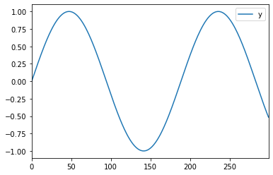

#+LAYOUT: post
#+title: test1 one
#+author: Louis

** Test1

#+begin_src jupyter-python :session jupyter-python :exports both :file hi.png 
# hello test
import pandas as pd
import matplotlib.pyplot as plt
import math
y = range(0, 300)
y = [math.sin(i/30) for i in y]
df = pd.DataFrame({'y': y})
df.plot()
plt.show()
#+end_src

#+RESULTS:

** Further Testing

#+begin_src haskell :exports both
--- Haskell
True && False
[0..20]
#+end_src

#+RESULTS:
| 0 | 1 | 2 | 3 | 4 | 5 | 6 | 7 | 8 | 9 | 10 | 11 | 12 | 13 | 14 | 15 | 16 | 17 | 18 | 19 | 20 |

